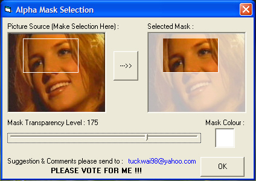



## Alpha Mask Selection @ Adobe Firework

### Description

This code mimic the picture alpha mask selection in the Firework, but with new feature such as transparency level &amp; mask colour selection, now you can save the extracted picture too ! Please Vote For Me !!!
 
### More Info
 

             |
---                |---
**Submitted On**   |2006-08-13 01:34:44
**By**             |[Looi Tuck Wai](https://github.com/Planet-Source-Code/PSCIndex/blob/master/ByAuthor/looi-tuck-wai.md)
**Level**          |Beginner
**User Rating**    |4.0 (16 globes from 4 users)
**Compatibility**  |VB 6\.0
**Category**       |[Graphics](https://github.com/Planet-Source-Code/PSCIndex/blob/master/ByCategory/graphics__1-46.md)
**World**          |[Visual Basic](https://github.com/Planet-Source-Code/PSCIndex/blob/master/ByWorld/visual-basic.md)
**Archive File**   |[Alpha\_Mask2013388142006\.zip](https://github.com/Planet-Source-Code/looi-tuck-wai-alpha-mask-selection-adobe-firework__1-66221/archive/master.zip)

